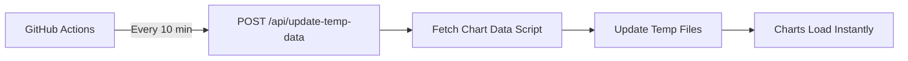

# 🔄 Auto-Update System for Chart Data

This system automatically updates chart data every 10 minutes using GitHub Actions - **perfect for Vercel Hobby deployments!**

## 🚀 Features

✅ **Free & Reliable** - Uses GitHub Actions (no additional costs)  
✅ **Vercel Compatible** - Works with any hosting platform  
✅ **Smart Scheduling** - Updates every 10 minutes automatically  
✅ **Manual Control** - Force updates anytime via GitHub UI  
✅ **Health Monitoring** - Built-in health checks and detailed logs  
✅ **Easy Setup** - Just add one GitHub secret and you're done!  

## ⚡ Quick Setup

### 1. Add GitHub Secret
1. Go to **GitHub Repository → Settings → Secrets and variables → Actions**
2. Click **New repository secret**
3. Add: `SITE_URL` = `https://your-app.vercel.app`

### 2. Deploy & Enjoy
- GitHub Actions will automatically start running every 10 minutes
- Monitor progress in **GitHub → Actions tab**
- Charts will always have fresh data!

## 📊 How It Works

1. **GitHub Actions** runs every 10 minutes on cron schedule
2. Calls your deployed app's `/api/update-temp-data` endpoint
3. Downloads fresh data from all chart APIs
4. Saves to temp files for instant loading
5. Charts display updated data immediately

## 🛠️ Manual Operations

### Force Update
1. Go to **GitHub → Actions → Auto Update Chart Data**
2. Click **Run workflow**
3. Enable **Force update** checkbox
4. Click **Run workflow**

### Add New Charts
1. Update chart configurations via admin panel
2. New charts will auto-update every 10 minutes

### Monitor Status
- **GitHub Actions**: Real-time logs and execution history
- **Admin Panel**: Shows GitHub Actions integration status

## 📁 Key Files

| File | Purpose |
|------|---------|
| `.github/workflows/update-temp-data.yml` | GitHub Actions workflow |
| `app/api/update-temp-data/route.ts` | API endpoint for updates |
| `app/api/health/route.ts` | Health check endpoint |
| `public/temp/fetch-chart-data.js` | Data fetching script |
| `docs/github-actions-setup.md` | Detailed setup guide |

## 🆚 Why GitHub Actions?

| Feature | GitHub Actions | Vercel Cron | Serverless Auto-Update |
|---------|----------------|-------------|----------------------|
| **Cost** | Free | $20/month | Unreliable |
| **Vercel Hobby** | ✅ Works | ❌ Requires Pro | ❌ Functions timeout |
| **Monitoring** | Built-in logs | Basic | None |
| **Manual Control** | Easy trigger | Limited | None |
| **Reliability** | High | High | Low |

## 🔍 Troubleshooting

**❌ Workflow not running?**
- Check if `SITE_URL` secret is set correctly
- Ensure repository has recent activity

**❌ API errors?**
- Verify your site is deployed and accessible
- Test: `curl https://your-site.com/api/health`

**📖 Need help?** See `docs/github-actions-setup.md` for detailed troubleshooting.

---

**🎉 You now have a bulletproof, free auto-update system that works perfectly with Vercel Hobby!** 